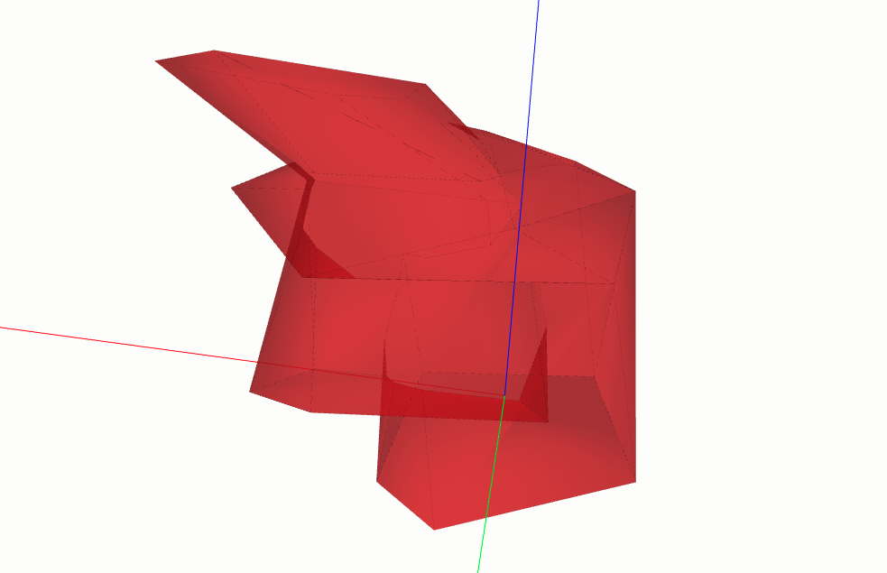
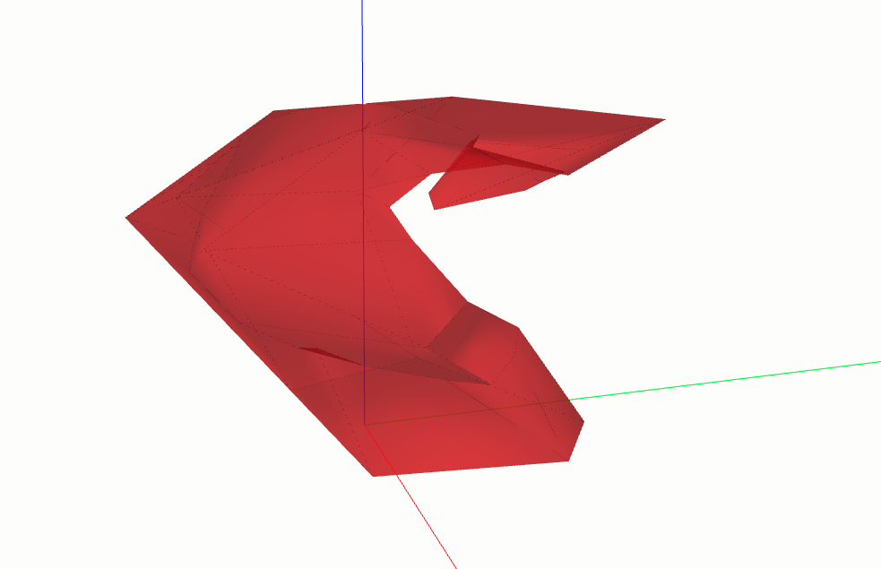
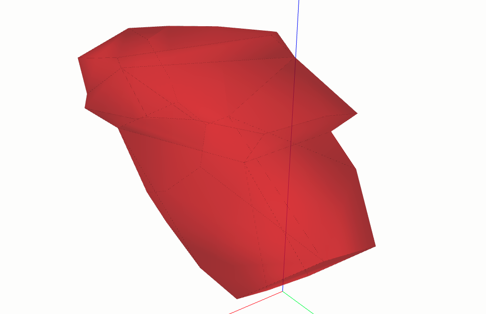

==================
BOOLEAN OPERATIONS
==================

Here we will present you all possible boolean operations using ClosedShell3D.

.. code-block:: python

    import volmdlr
    from volmdlr import edges, curves, surfaces, wires, faces, shells
    from volmdlr.core import EdgeStyle
    import math

    # Create a random shape shell's faces
    polygon1_vol1 = wires.ClosedPolygon3D([volmdlr.Point3D(-0.1, -0.05, 0),
                                           volmdlr.Point3D(-0.15, 0.1, 0),
                                           volmdlr.Point3D(0.05, 0.2, 0),
                                           volmdlr.Point3D(0.12, 0.15, 0),
                                           volmdlr.Point3D(0.1, -0.02, 0)])

    polygon2_vol1 = polygon1_vol1.rotation(volmdlr.O3D,
                                           volmdlr.Z3D, math.pi).translation(0.2*volmdlr.Z3D)
    polygon3_vol1 = polygon2_vol1.rotation(
            volmdlr.O3D, volmdlr.Z3D, math.pi/8).translation(0.1*(
                            volmdlr.Z3D+volmdlr.X3D+volmdlr.Y3D))
    faces_ = [faces.Triangle3D(*points)
                for points in polygon1_vol1.sewing(polygon2_vol1,
                                                   volmdlr.X3D, volmdlr.Y3D)] \
                + [faces.Triangle3D(*points)
                for points in polygon2_vol1.sewing(polygon3_vol1, volmdlr.X3D, volmdlr.Y3D)]
    bottom_surface3d = surfaces.Plane3D.from_plane_vectors(volmdlr.O3D,
                                                           volmdlr.X3D,
                                                           volmdlr.Y3D)
    bottom_surface2d = surfaces.Surface2D(polygon1_vol1.to_2d(volmdlr.O3D,
                                                              volmdlr.X3D,
                                                              volmdlr.Y3D),[])

    top_surface3d = surfaces.Plane3D.from_plane_vectors(0.3*volmdlr.Z3D,
                                                        volmdlr.X3D,
                                                        volmdlr.Y3D)
    top_surface2d = surfaces.Surface2D(polygon3_vol1.to_2d(volmdlr.O3D,
                                                           volmdlr.X3D,
                                                           volmdlr.Y3D),[])

    bottom_face = faces.PlaneFace3D(bottom_surface3d, bottom_surface2d)
    top_face = faces.PlaneFace3D(top_surface3d, top_surface2d)
    faces_ += [bottom_face, top_face]

    #Instanciate shell
    shell1 = shells.ClosedShell3D(faces_, color=(1, .1, .1), alpha=0.6)

    shell2 = shell1.rotation(volmdlr.O3D, volmdlr.X3D, math.pi / 5)
    shell2 = shell2.translation(volmdlr.Vector3D(.1, .1, .1))
    volmdlr.core.VolumeModel([shell1, shell2]).babylonjs()

    ...

Union
*****

.. code-block:: python

    ...

    union = shell1.union(shell2)
    union[0].color = (1, 0.1, 0.1)
    union[0].alpha = 0.6
    union[0].babylonjs()

Here, as the subtitle indicates, it is basically done the union of the two closed shells.
To do so, it will first verify if the two closed shells intersect some how. If it does not intersect, it will return a list with the exact two given closed shells.
If one of the given shells is completely inside the other, it'll simply return a list the bigger shell.
Otherwise, it will return a list with the resulting union closed shell 3d.

Substraction
************

.. code-block:: python

    ...

    subtract = shell1.subtract(shell2)
    subtract[0].color = (1, 0.1, 0.1)
    subtract[0].alpha = 0.6
    subtract[0].babylonjs()

Here it is done the extraction of shell2 from shell1. If the two shells do not intersect in any way, a list containing only the shell 1 is returned.
If shell2 is inside shell1, a closed shell with a void interior shell is returned.
Otherwise, the shell2 is subtracted from shell1 and the result is a list containing an OpenShell3D.

.. figure:: ../source/_static/index-images/subtract.png

Substraction to CloseShell3D
****************************

.. code-block:: python

    ...

    subtract_to_closed_shell = shell1.subtract_to_closed_shell(shell2)
    subtract_to_closed_shell[0].color = (1, 0.1, 0.1)
    subtract_to_closed_shell[0].alpha = 0.6
    subtract_to_closed_shell[0].babylonjs()

The method ``subtract_to_closed_shell`` will do exactly as the previous subtract do, but it will return a list with the closed shell shell instead of a open shell.

Intersection
************

.. code-block:: python

    ...

    intersection = shell1.intersection(shell2)
    intersection[0].color = (1, 0.1, 0.1)
    intersection[0].alpha = 0.6
    intersection[0].babylonjs()

The intersection method will calculate the closed shell resulting from the intersection of the two shells.

