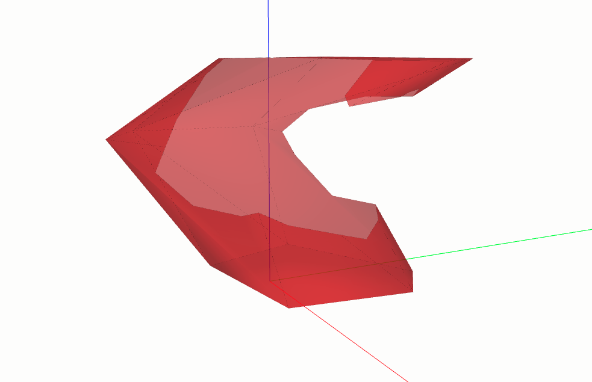

==================
BOOLEAN OPERATIONS
==================

This section will demonstrate all available boolean operations through the usage of `ClosedShell3D`.

.. code-block:: python

    import math

    import volmdlr
    from volmdlr.faces import PlaneFace3D, Triangle3D
    from volmdlr.shells import ClosedShell3D
    from volmdlr.surfaces import Plane3D, Surface2D
    from volmdlr.wires import ClosedPolygon3D

    # Create the contours of the faces of a random shape
    polygon1_vol1 = ClosedPolygon3D(
        [
            volmdlr.Point3D(-0.1, -0.05, 0),
            volmdlr.Point3D(-0.15, 0.1, 0),
            volmdlr.Point3D(0.05, 0.2, 0),
            volmdlr.Point3D(0.12, 0.15, 0),
            volmdlr.Point3D(0.1, -0.02, 0),
        ]
    )
    polygon2_vol1 = polygon1_vol1.rotation(volmdlr.O3D, volmdlr.Z3D, math.pi).translation(
        0.2 * volmdlr.Z3D
    )
    polygon3_vol1 = polygon2_vol1.rotation(volmdlr.O3D, volmdlr.Z3D, math.pi / 8).translation(
        0.1 * (volmdlr.Z3D + volmdlr.X3D + volmdlr.Y3D)
    )

    # Create the faces of the shape
    faces = [
        Triangle3D(*points)
        for points in polygon1_vol1.sewing(polygon2_vol1, volmdlr.X3D, volmdlr.Y3D)
    ] + [
        Triangle3D(*points)
        for points in polygon2_vol1.sewing(polygon3_vol1, volmdlr.X3D, volmdlr.Y3D)
    ]

    # Create the top and bottom faces of the shape
    bottom_surface3d = Plane3D.from_plane_vectors(volmdlr.O3D, volmdlr.X3D, volmdlr.Y3D)
    bottom_surface2d = Surface2D(polygon1_vol1.to_2d(volmdlr.O3D, volmdlr.X3D, volmdlr.Y3D), [])
    top_surface3d = Plane3D.from_plane_vectors(0.3 * volmdlr.Z3D, volmdlr.X3D, volmdlr.Y3D)
    top_surface2d = Surface2D(polygon3_vol1.to_2d(volmdlr.O3D, volmdlr.X3D, volmdlr.Y3D), [])
    bottom_face = PlaneFace3D(bottom_surface3d, bottom_surface2d)
    top_face = PlaneFace3D(top_surface3d, top_surface2d)
    faces += [bottom_face, top_face]

    # Create the shells from these faces
    shell1 = shells.ClosedShell3D(faces_, color=(1.0, 0.1, 0.1), alpha=0.6)
    shell2 = shell1.rotation(volmdlr.O3D, volmdlr.X3D, math.pi / 5)
    shell2 = shell2.translation(volmdlr.Vector3D(0.1, 0.1, 0.1))
    shell2.color = (0.1, 1.0, 0.1)

    # Create a volume model from these shells and display it
    volmdlr.core.VolumeModel([shell1, shell2]).babylonjs()

    ...

Union
*****

.. code-block:: python

    ...
    union = shell1.union(shell2)
    union[0].color = (1.0, 0.1, 0.1)
    union[0].alpha = 0.6
    union[0].babylonjs()  # Display the result

As indicated by the subtitle, this step involves performing the union operation on the two closed shells.

The process begins by checking for any potential intersection between the two closed shells.
If no intersection is found, a list containing the original pair of closed shells is returned.
In cases where one closed shell is entirely contained within the other, the function will return a list containing only
the larger shell. For scenarios where partial overlap occurs, the function will yield a list containing the resulting 3D
union closed shell.

.. figure:: ../source/_static/index-images/union.png

Substraction
************

.. code-block:: python

    ...
    subtract = shell1.subtract(shell2)
    subtract[0].color = (1.0, 0.1, 0.1)
    subtract[0].alpha = 0.6
    subtract[0].babylonjs()  # Display the result

This operation involves extracting `shell2` from `shell1`.

When there's no intersection between the two shells, the function returns a list containing only `shell1`.
In cases where `shell2` is entirely encompassed by shell1, the function produces a closed shell with an empty interior.
Otherwise, `shell2` is subtracted from `shell1`, resulting in a list containing an `OpenShell3D` object.

Substraction to CloseShell3D
****************************

.. code-block:: python

    ...

    subtract_to_closed_shell = shell1.subtract_to_closed_shell(shell2)
    subtract_to_closed_shell[0].color = (1.0, 0.1, 0.1)
    subtract_to_closed_shell[0].alpha = 0.6
    subtract_to_closed_shell[0].babylonjs()  # Display the result

The method ``subtract_to_closed_shell`` functions similarly to the previous subtraction method, but it differs in its
output. Instead of returning an open shell, this method will provide a list containing the resulting closed shell.

Intersection
************

.. code-block:: python

    ...

    intersection = shell1.intersection(shell2)
    intersection[0].color = (1.0, 0.1, 0.1)
    intersection[0].alpha = 0.6
    intersection[0].babylonjs()  # Display the result

The intersection method calculates the closed shell that arises from the intersection of the two input shells.

.. figure:: ../source/_static/index-images/intersection.png
