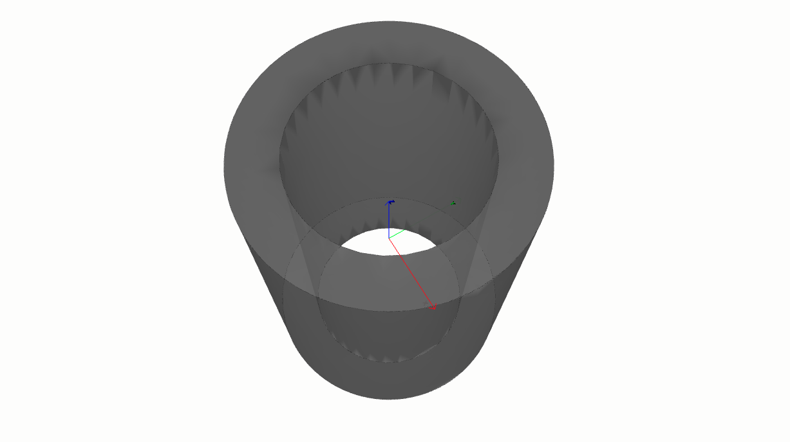

==============================================
Section on how to create Basic volmdlr objects
==============================================

Basic Objects
*************

How to create a Vector
======================

To instantiate the Vector, you need to provide the required arguments. In this case, the constructor
expects two mandatory arguments x and y for the 2-dimensional vector, and an additional argument z for the
3-dimensional vector, which are floats representing the vector's coordinates.
Additionally, there is an optional argument name, which is a string representing the vector's name.

.. grid:: 2

    .. grid-item-card::  Vector2D

        .. plot::
           :include-source:
           :align: center

           import volmdlr

           vector = volmdlr.Vector2D(1.0, 1.0)
           vector.plot(color='orange')

    .. grid-item-card::  Vector3D

        .. plot::
           :include-source:
           :align: center

           import volmdlr

           vector = volmdlr.Vector3D(1.0, 1.0, 1.0)
           vector.plot(color='orange')

How to create a Point
=====================

Point 2D
--------
To instantiate the Point2D class, you need to provide the two mandatory arguments required x and y,
which are both floats representing the vector's coordinates. Additionally, there is an optional argument name,
which is a string representing the vector's name.

.. code-block:: python

   import volmdlr

   point2d = volmdlr.Point2D(x=1.0, y=2.0, name='vector name')
   print('point2d:', point2d)
   >>> point2d: Point2D: [1.0, 2.0]

Point 3D
--------
To instantiate the Point3D class, you need to provide three mandatory arguments required x, y, z
which are floats representing the vector's coordinates. Additionally, there is an optional argument name,
which is a string representing the vector's name.

.. code-block:: python

   import volmdlr

   point3d = volmdlr.Point3D(x=1.0, y=2.0, z=3.0, name='vector name')
   print('point3d:', point3d)
   >>> point2d: Point3D: [1.0, 2.0, 3.0]

How to create a Frame3D
=======================
The given class Frame3D represents a 3D frame. It defines a frame by specifying its origin point and
three basis vectors (u, v, and w) that determine the orientation of the frame.

Exmaple:

.. plot::
   :include-source:
   :align: center

   import volmdlr

   origin = volmdlr.Point3D(0, 0, 0)
   u = volmdlr.Vector3D(1, 0, 0)
   v = volmdlr.Vector3D(0, 1, 0)
   w = volmdlr.Vector3D(0, 0, 1)
   frame = volmdlr.Frame3D(origin, u, v, w)
   frame.plot()

Curves
******

How to create Line in 2D and 3D
===============================

Line2D and Line3D represents an infinite lines in both 2 and 3D that passes through two points.
They are a subclass of Line, which handles line-related operations. The class takes two Point objects
as inputs to define the line and an optional name for identification.

To instantiate then, you need to create an object of of the corresponding class by calling its constructor (__init__)
and providing the required arguments. Here's how you can do it:

.. grid:: 1

    .. grid-item-card::  Line2D

        .. plot::
           :include-source:
           :align: center

           import volmdlr
           from volmdlr import curves
           from volmdlr.core import EdgeStyle

           point1 = volmdlr.Point2D(1.0, 1.0)
           point2 = volmdlr.Point2D(-2.0, -3.0)
           line2d = curves.Line2D(point1, point2, name='line2d_name_is_optional')
           line2d.plot(edge_style=EdgeStyle('orange'))

    .. grid-item-card::  Line3D

        .. plot::
           :include-source:
           :align: center

           import volmdlr
           from volmdlr import curves
           from volmdlr.core import EdgeStyle

           point1 = volmdlr.Point3D(1.0, 1.0, 1.0)
           point2 = volmdlr.Point3D(-2.0, -3.0, -1.0)
           line3d = curves.Line3D(point1, point2, name='line3d_name_is_optional')
           line3d.plot(edge_style=EdgeStyle('orange'))

How to create a Circle
======================

Circle2D
--------

The circle2d  is defined by its center point (Point2D) and a radius (float),
and it also accepts an optional name for identification.

.. grid-item-card::

    .. plot::
       :include-source:
       :align: center

       import volmdlr
       from volmdlr import curves
       from volmdlr.core import EdgeStyle

       center2d = volmdlr.Point2D(0.0, 0.0)
       circle2d = curves.Circle2D(frame=volmdlr.OXY, radius=1, name='optional_circle_name')
       circle2d.plot(edge_style=EdgeStyle('orange'))

Circle3D
--------

The circle is defined by a Frame3D object that includes information about the center and orientation of the
circle in 3D space, along with a radius (float). The frame's u and v vectors define the plane in which the
circle lies, and w represents the normal vector to the plane.

.. grid-item-card::

    .. plot::
       :include-source:
       :align: center

       import volmdlr
       from volmdlr import curves
       from volmdlr.core import EdgeStyle

       center3D = volmdlr.Point3D(0.0, 0.0, 0.0)
       u_vector = volmdlr.Vector3D(1.0, 0.0, 0.0)
       v_vector = volmdlr.Vector3D(0.0, 1.0, 0.0)
       w_vector = volmdlr.Vector3D(0.0, 0.0, 1.0)
       frame3d = volmdlr.Frame3D(center3D, u_vector, v_vector, w_vector)
       circle3d = curves.Circle3D(frame=frame3d, radius=1, name='optional_circle_name')
       circle3d.plot(edge_style=EdgeStyle('orange'))

How to create an Ellipse
========================

An ellipse in defined by three arguments: a major axis (A), e minor axis (B) and a Frame (2D or 3D).

.. grid:: 1

    .. grid-item-card::  Ellipse2D

        .. plot::
           :include-source:
           :align: center

           import volmdlr
           from volmdlr import curves
           from volmdlr.core import EdgeStyle

           u_vector = volmdlr.Vector2D(0.7071067811865475, 0.7071067811865475)
           v_vector = volmdlr.Vector2D(-0.7071067811865475, 0.7071067811865475)
           ellipse2d = curves.Ellipse2D(major_axis=2, minor_axis=1, frame=volmdlr.Frame2D(volmdlr.O2D, u_vector, v_vector))
           ellipse2d.plot(edge_style=EdgeStyle(color='orange'))

    .. grid-item-card::  Ellipse3D

        .. plot::
           :include-source:
           :align: center

           import volmdlr
           from volmdlr import curves
           from volmdlr.core import EdgeStyle

           vector1 = volmdlr.Vector3D(1, 1, 1)
           vector1 = vector1.unit_vector()
           vector2 = vector1.deterministic_unit_normal_vector()
           vector3 = vector1.cross(vector2)
           frame = volmdlr.Frame3D(volmdlr.O3D, vector1, vector2, vector3)
           ellipse3d = curves.Ellipse3D(major_axis=2, minor_axis=1, frame=frame)
           ellipse3d.plot(edge_style=EdgeStyle('orange'))

How to create an Hyperbola
==========================

A Hyperbola in defined by three arguments: a frame (2D or 3D), a semi major axis and a semi minor axis.
For more details on Hyperbolas, you can search for the corresponding class in :ref:`curves`:.

.. grid:: 1

    .. grid-item-card::  Hyperbola2D

        .. plot::
            :include-source:
            :align: center

            import volmdlr
            from volmdlr import curves
            from volmdlr.core import EdgeStyle

            hyperberbola_2d = curves.Hyperbola2D(volmdlr.OXY, 1, 2)
            hyperberbola_2d.plot(edge_style=EdgeStyle(color='orange'))

    .. grid-item-card::  Hyperbola3D

        .. plot::
            :include-source:
            :align: center

            import volmdlr
            from volmdlr import curves
            from volmdlr.core import EdgeStyle

            hyperberbola_3d = curves.Hyperbola3D(volmdlr.OXYZ, 1, 2)
            hyperberbola_3d.plot(edge_style=EdgeStyle(color='orange'))

How to create an Parabola
=========================

A Parabola in defined by two arguments: a frame (2D or 3D) and the focal length value. There's also an optional name parameter.
For more details on Parabolas, you can search for the corresponding class in :ref:`curves`:.

.. grid:: 1

    .. grid-item-card::  Parabola2D

        .. plot::
            :include-source:
            :align: center

            import volmdlr
            from volmdlr import curves
            from volmdlr.core import EdgeStyle

            parabola_2d = curves.Parabola2D(volmdlr.OXY, 1)
            parabola_2d.plot(edge_style=EdgeStyle(color='orange'))

    .. grid-item-card::  Parabola3D

        .. plot::
            :include-source:
            :align: center

            import volmdlr
            from volmdlr import curves
            from volmdlr.core import EdgeStyle

            parabola_3d = curves.Parabola3D(volmdlr.OXYZ, 2)
            parabola_3d.plot(edge_style=EdgeStyle(color='orange'))

Edges
*****

How to create a LineSegment
===========================

To instanciate a LineSegment in 2D or 3D, you will need to provide two mandatory arguments, the start and end points.
Additionally you will have two optional arguments: an infinite line which the line segment lies on and a name argument.

LineSegment2D
-------------
.. grid:: 1

    .. grid-item-card::

        .. plot::
           :include-source:
           :align: center

           import volmdlr
           from volmdlr import edges
           from volmdlr.core import EdgeStyle

           start_point = volmdlr.Point2D(1.0, 1.0)
           end_point = volmdlr.Point2D(3.0, 4.0)
           linesegment2d = edges.LineSegment2D(start=start_point, end=end_point, name='linesegment\'s name')
           linesegment2d.plot(edge_style=EdgeStyle(color='orange'))

LineSegment3D
-------------

.. grid:: 1

    .. grid-item-card::

        .. plot::
           :include-source:
           :align: center

           import volmdlr
           from volmdlr import edges
           from volmdlr.core import EdgeStyle

           start_point = volmdlr.Point3D(1.0, 1.0, 1.0)
           end_point = volmdlr.Point3D(3.0, 4.0, 6.0)
           linesegment3d = edges.LineSegment3D(start=start_point, end=end_point, name='linesegment\'s name')
           linesegment3d.plot(edge_style=EdgeStyle(color='orange'))

How to create an Arc
====================

Arc2D
-----

An Arc2D is defined by the base circle curve along with a start and end points.
There is also a boolean is_trigo argument that defines if the arc is in the trigo-wise direction or not and a last and optional name argument.

.. grid:: 1

    .. grid-item-card::

        .. plot::
           :include-source:
           :align: center

           import volmdlr
           from volmdlr import edges, curves
           from volmdlr.core import EdgeStyle

           circle2d = curves.Circle2D(volmdlr.OXY, 1)
           arc2d = edges.Arc2D(circle2d, volmdlr.Point2D(-1, 0), volmdlr.Point2D(1, 0), True)
           ax = arc2d.plot(edge_style=EdgeStyle('orange'))
           ax.set_aspect('equal')

Arc3D
-----

Just as the Arc2D, Arc3D is defined by the base circle curve along with a start and end points. There is also an optional name argument.

.. grid:: 1

    .. grid-item-card::

        .. plot::
           :include-source:
           :align: center

           import volmdlr
           from volmdlr import edges, curves
           from volmdlr.core import EdgeStyle

           vector1 = volmdlr.Vector3D(1, 1, 1)
           vector1 = vector1.unit_vector()
           vector2 = vector1.deterministic_unit_normal_vector()
           vector3 = vector1.cross(vector2)
           frame = volmdlr.Frame3D(volmdlr.O3D, vector1, vector2, vector3)
           circle3d = curves.Circle3D(frame, 1)
           arc3d = edges.Arc3D(circle3d, start=volmdlr.Point3D(0.5773502691896258, 0.5773502691896258, 0.5773502691896258),
                       end=volmdlr.Point3D(-0.9855985596534886, -0.11957315586905026, -0.11957315586905026))
           ax = arc3d.plot(edge_style=EdgeStyle('orange'))

How to create an ArcEllipse
===========================

Both ArcEllipse2D and ArcEllipse3D require a base Ellipse curve along with a start end end points.
There also an optional name argument.

ArcEllipse2D
------------

Object's descrition

.. grid:: 1

    .. grid-item-card::

        .. plot::
           :include-source:
           :align: center

           import volmdlr
           from volmdlr import edges, curves
           from volmdlr.core import EdgeStyle

           u_vector = volmdlr.Vector2D(0.7071067811865475, 0.7071067811865475)
           v_vector = volmdlr.Vector2D(-0.7071067811865475, 0.7071067811865475)
           ellipse2d = curves.Ellipse2D(2, 1, volmdlr.Frame2D(volmdlr.O2D, u_vector, v_vector))
           u_vector = volmdlr.Vector2D(0.7071067811865475, 0.7071067811865475)
           v_vector = volmdlr.Vector2D(-0.7071067811865475, 0.7071067811865475)
           ellipse2d = curves.Ellipse2D(2, 1, volmdlr.Frame2D(volmdlr.O2D, u_vector, v_vector))
           arc_ellipse2d = edges.ArcEllipse2D(ellipse2d, start=volmdlr.Point2D(0.5, 1.5), end=volmdlr.Point2D(1.5, 0.5))
           arc_ellipse2d.plot(edge_style=EdgeStyle('orange'))

ArcEllipse3D
------------

Object's descrition

.. grid:: 1

    .. grid-item-card::

        .. plot::
           :include-source:
           :align: center

           import volmdlr
           from volmdlr import edges, curves
           from volmdlr.core import EdgeStyle

           vector1 = volmdlr.Vector3D(1, 1, 1)
           vector1 = vector1.unit_vector()
           vector2 = vector1.deterministic_unit_normal_vector()
           vector3 = vector1.cross(vector2)
           frame = volmdlr.Frame3D(volmdlr.O3D, vector1, vector2, vector3)
           start_point = volmdlr.Point3D(0.2391463117381003, 1.1051717155225391, 1.1051717155225391)
           end_point = volmdlr.Point3D(-1.393846850117352, -0.5278214463329132, -0.5278214463329132)
           ellipse3d = curves.Ellipse3D(2, 1, frame)
           arc_ellipse3d = edges.ArcEllipse3D(ellipse3d, start=start_point, end=end_point)
           arc_ellipse3d.plot(edge_style=EdgeStyle('orange'))

How to create a BSplineCurve
============================

To instanciate a BsplineCurve 2D or 3D, we must provide the necessary parameters, such as the degree, control points,
knot multiplicities, knot vector, and optional weights and name.

BSplineCurve2D
--------------

.. grid:: 1

    .. grid-item-card::

        .. plot::
           :include-source:
           :align: center

           import volmdlr
           from volmdlr import edges
           from volmdlr.core import EdgeStyle
           from geomdl import utilities

           DEGREE = 3
           points = [volmdlr.Point2D(0, 0), volmdlr.Point2D(1, 1), volmdlr.Point2D(2, -1), volmdlr.Point2D(3, 0)]
           knotvector = utilities.generate_knot_vector(DEGREE, len(points))
           knot_multiplicity = [1] * len(knotvector)
           bspline1 = edges.BSplineCurve2D(DEGREE, points, knot_multiplicity, knotvector, None, False)
           bspline1.plot(edge_style=EdgeStyle('orange'))

BSplineCurve3D
--------------

.. grid:: 1

    .. grid-item-card::

        .. plot::
           :include-source:
           :align: center

           import volmdlr
           from volmdlr import edges
           from volmdlr.core import EdgeStyle

           degree = 5
           control_points = [volmdlr.Point3D(0, 3, 0),
                             volmdlr.Point3D(3, 2, 1),
                             volmdlr.Point3D(5, -1, 4),
                             volmdlr.Point3D(5, -4, 0),
                             volmdlr.Point3D(-1, -2, -3),
                             volmdlr.Point3D(-3, 4, 1)]
           knots = [0.0, 1.0]
           knot_multiplicities = [6, 6]
           weights = None  # [1, 2, 1, 2, 1, 2]
           bspline_curve3d = edges.BSplineCurve3D(degree=degree, control_points=control_points,
                                           knot_multiplicities=knot_multiplicities,
                                           knots=knots,
                                           weights=weights,
                                           name='B Spline Curve 3D 1')
           bspline_curve3d.plot(edge_style=EdgeStyle('orange'))

Wires
*****

How to create a Wire
====================

A wire is an object composed of a list of primitives that does not form a closed and an optional name. This primitives list can contain any set of edges following each other.

Wire2D
------

.. grid:: 1

    .. grid-item-card::

        .. plot::
           :include-source:
           :align: center

           import volmdlr
           from volmdlr import wires, edges
           from volmdlr.core import EdgeStyle

           line_segment1 = edges.LineSegment2D(volmdlr.Point2D(1, -1), volmdlr.Point2D(1.5, 1))
           arc = edges.Arc2D.from_3_points(volmdlr.Point2D(1.5, 1), volmdlr.Point2D(1.3, 1.5), volmdlr.Point2D(0.5, 1.5))
           points2d = [volmdlr.Point2D(-1, 1), volmdlr.Point2D(2, 2), volmdlr.Point2D(-2, -2), volmdlr.Point2D(1, -1)]
           bspline = edges.BSplineCurve2D(3, points2d, knot_multiplicities=[4, 4], knots=[0.0, 1.0])
           wire2d = wires.Wire2D([bspline, line_segment1, arc])
           wire2d.plot(edge_style=EdgeStyle('orange'))

Wire3D
------

.. grid:: 1

    .. grid-item-card::

        .. plot::
           :include-source:
           :align: center

           import volmdlr
           from volmdlr import edges, wires
           from volmdlr.core import EdgeStyle

           degree = 5
           control_points = [volmdlr.Point3D(0, 3, 0),
                            volmdlr.Point3D(3, 2, 1),
                            volmdlr.Point3D(5, -1, 4),
                            volmdlr.Point3D(5, -4, 0),
                            volmdlr.Point3D(-1, -2, -3),
                            volmdlr.Point3D(-3, 4, 1)]
           knots = [0.0, 1.0]
           knot_multiplicities = [6, 6]
           weights = None  # [1, 2, 1, 2, 1, 2]
           bspline_curve3d = edges.BSplineCurve3D(degree=degree, control_points=control_points,
                                          knot_multiplicities=knot_multiplicities,
                                          knots=knots,
                                          weights=weights,
                                          name='B Spline Curve 3D 1')
           lineseg1 = edges.LineSegment3D(volmdlr.Point3D(3, 3, 2), bspline_curve3d.start)
           lineseg2 = edges.LineSegment3D(bspline_curve3d.end, volmdlr.Point3D(-3, -3, 0))
           wire3d = wires.Wire3D([lineseg1, bspline_curve3d, lineseg2])
           wire3d.plot(edge_style=EdgeStyle('orange'))

How to create a Contour
=======================

As a  wire, A contour is also an object composed of a list of primitives but now it forms a closed loop.
The optional name argument is always present. The primitives list can contain any set of edges following each other.

Contour2D
---------

.. grid:: 1

    .. grid-item-card::

        .. plot::
           :include-source:
           :align: center

           import volmdlr
           from volmdlr import edges, wires
           from volmdlr.core import EdgeStyle

           line_segment1 = edges.LineSegment2D(volmdlr.Point2D(1, -1), volmdlr.Point2D(1.5, 1))
           line_segment2 = edges.LineSegment2D(volmdlr.Point2D(0.5, 1.5), volmdlr.Point2D(-2, 1))
           line_segment3 = edges.LineSegment2D(volmdlr.Point2D(-2, 1), volmdlr.Point2D(-2, 0.7))
           line_segment4 = edges.LineSegment2D(volmdlr.Point2D(-2, 0.7), volmdlr.Point2D(-1, 1))
           arc = edges.Arc2D.from_3_points(volmdlr.Point2D(1.5, 1), volmdlr.Point2D(1.3, 1.5), volmdlr.Point2D(0.5, 1.5))
           points2d = [volmdlr.Point2D(-1, 1), volmdlr.Point2D(2, 2), volmdlr.Point2D(-2, -2), volmdlr.Point2D(1, -1)]
           bspline = edges.BSplineCurve2D(3, points2d, knot_multiplicities=[4, 4], knots=[0.0, 1.0])
           wire2d = wires.Wire2D([bspline, line_segment1, arc, line_segment2, line_segment3, line_segment4])
           wire2d.plot(edge_style=EdgeStyle('orange'))

Contour3D
---------

.. grid:: 1

    .. grid-item-card::

        .. plot::
           :include-source:
           :align: center

           import volmdlr
           from volmdlr import edges, wires
           from volmdlr.core import EdgeStyle

           degree = 5
           control_points = [volmdlr.Point3D(0, 3, 0),
                            volmdlr.Point3D(3, 2, 1),
                            volmdlr.Point3D(5, -1, 4),
                            volmdlr.Point3D(5, -4, 0),
                            volmdlr.Point3D(-1, -2, -3),
                            volmdlr.Point3D(-3, 4, 1)]
           knots = [0.0, 1.0]
           knot_multiplicities = [6, 6]
           weights = None  # [1, 2, 1, 2, 1, 2]
           bspline_curve3d = edges.BSplineCurve3D(degree=degree, control_points=control_points,
                                          knot_multiplicities=knot_multiplicities,
                                          knots=knots,
                                          weights=weights,
                                          name='B Spline Curve 3D 1')
           lineseg1 = edges.LineSegment3D(volmdlr.Point3D(3, 3, 2), bspline_curve3d.start)
           lineseg2 = edges.LineSegment3D(bspline_curve3d.end, volmdlr.Point3D(-3, -3, 0))
           arc = edges.Arc3D.from_3_points(volmdlr.Point3D(-3, -3, 0), volmdlr.Point3D(6.324555320336761, -5.692099788303083, -0.8973665961010275), volmdlr.Point3D(3, 3, 2))
           wire3d = wires.Wire3D([lineseg1, bspline_curve3d, lineseg2, arc])
           wire3d.plot(edge_style=EdgeStyle('orange'))

Surfaces
********

Surface2D
=========

To create a `Surface2D`, you need to provide two arguments: a `outer_contour` and a `inner_contours` and an optional `name` parameter.

Attributes:
`outer_contour`: This is a parameter passed to the constructor representing the outer boundary or contour of the surface. It is of type wires.Contour2D, which is a series of connected points that form a closed loop.

`inner_contours`: This is a parameter representing a list of inner contours within the surface. It is of type List[wires.Contour2D], indicating that there can be multiple inner contours. Inner contours could represent holes or cutouts within the surface.

`name`: An optional parameter representing the name of the surface. The default value is set to 'name' if not provided.

.. grid:: 1

    .. grid-item-card::

        .. plot::
           :include-source:
           :align: center

           import volmdlr
           from volmdlr import surfaces
           from volmdlr.core import EdgeStyle

           p1s = volmdlr.Point2D(0, 0)
           p2s = volmdlr.Point2D(0.1, 0)
           p3s = volmdlr.Point2D(0.2, 0.1)
           p4s = volmdlr.Point2D(-0.01, 0.05)
           surface2d = surfaces.Surface2D(volmdlr.wires.ClosedPolygon2D([p1s, p2s, p3s, p4s]), [])
           surface2d.plot(edge_style=EdgeStyle('orange'))

Plane3D
=======

`Plane3D` represents a three-dimensional plane. To build it, it is needed a `frame` and an optinal `name` paramenter.

`frame`: This is a parameter passed to the constructor, representing a three-dimensional frame that describes the plane. The frame consists of an origin o and vectors u and v that define the plane, and w represents the normal vector to the plane. This implies that the plane is defined by a local coordinate system.

`name`: An optional parameter representing the name of the plane. The default value is an empty string if not provided.

.. grid:: 1

    .. grid-item-card::

        .. plot::
           :include-source:
           :align: center

           import volmdlr
           from volmdlr import edges, curves, surfaces, wires, faces
           from volmdlr.core import EdgeStyle

           surface3d = surfaces.Plane3D(volmdlr.Frame3D(volmdlr.Point3D(0.0, 0.0, 0.0), volmdlr.Vector3D(1.0, 0.0, 0.0),
                                                       volmdlr.Vector3D(0.0, 1.0, 0.0), volmdlr.Vector3D(0.0, 0.0, 1.0)))
           surface3d.plot(edge_style=EdgeStyle('orange'), length=2)

CylindricalSurface3D
====================

To instanciate a CylindricalSurface3D, you have to provide tree parameters: a `frame`, a `radius`, and an optional `name`.

`frame`: This is a parameter passed to the constructor, representing a three-dimensional frame that describes the plane. The frame consists of an origin o and vectors u and v that define the plane, and w represents the normal vector to the plane. This implies that the plane is defined by a local coordinate system.

`radius`: The Cylinder radius.

`name`: An optional parameter representing the name of the plane. The default value is an empty string if not provided.

.. grid:: 1

    .. grid-item-card::

        .. plot::
           :include-source:
           :align: center

           import volmdlr
           from volmdlr import surfaces
           from volmdlr.core import EdgeStyle

           surface3d = surfaces.CylindricalSurface3D(volmdlr.OXYZ, 1, 'cylindrical_surface_name')
           surface3d.plot(edge_style=EdgeStyle('orange'), length=2)

ToroidalSurface3D
=================

To instanciate a ToroidalSurface3D, you have to provide tree parameters: a `frame`, a `major_radius`, a `minor_radius` and an optional `name`.

`frame`: This is a parameter passed to the constructor, representing a three-dimensional frame that describes the plane. The frame consists of an origin o and vectors u and v that define the plane, and w represents the normal vector to the plane. This implies that the plane is defined by a local coordinate system.

`major_radius`: The torus major radius.

`minor_radius`: The torus minor radius.

`name`: An optional parameter representing the name of the plane. The default value is an empty string if not provided.

.. grid:: 1

    .. grid-item-card::

        .. plot::
           :include-source:
           :align: center

           import volmdlr
           from volmdlr import surfaces
           from volmdlr.core import EdgeStyle
           surface3d = surfaces.ToroidalSurface3D(frame=volmdlr.OXYZ, major_radius=2, minor_radius=1, name='toroidal_surface_name')
           surface3d.plot(edge_style=EdgeStyle('orange'), length=2)

ConicalSurface3D
================

To instanciate a ConicalSurface3D, you have to provide tree parameters: a `frame`, a `angle` and an optional `name` parameter.

`frame`: This is a parameter passed to the constructor, representing a three-dimensional frame that describes the plane. The frame consists of an origin o and vectors u and v that define the plane, and w represents the normal vector to the plane. This implies that the plane is defined by a local coordinate system.

`semi_angle`: This is a parameter represents the semi-angle of the cone. The semi-angle defines the opening of the cone.

`name`: An optional parameter representing the name of the plane. The default value is an empty string if not provided.

.. grid:: 1

    .. grid-item-card::

        .. plot::
           :include-source:
           :align: center

           import volmdlr
           from volmdlr import surfaces
           from volmdlr.core import EdgeStyle

           surface3d = surfaces.ConicalSurface3D(frame=volmdlr.OXYZ, semi_angle=1.5, name='conical_surface_name')
           surface3d.plot(edge_style=EdgeStyle('orange'), z=5)

SphericalSurface3D
==================

To instanciate a SphericalSurface3D, you have to provide tree parameters: a `frame`, a `radius` and an optional `name`.

`frame`: This is a parameter passed to the constructor, representing a three-dimensional frame that describes the plane. The frame consists of an origin o and vectors u and v that define the plane, and w represents the normal vector to the plane. This implies that the plane is defined by a local coordinate system.

`radius`: This parameter represents the radius of the sphere.

`name`: An optional parameter representing the name of the plane. The default value is an empty string if not provided.

.. grid:: 1

    .. grid-item-card::

        .. plot::
           :include-source:
           :align: center

           import volmdlr
           from volmdlr import surfaces
           from volmdlr.core import EdgeStyle

           surface3d = surfaces.SphericalSurface3D(frame=volmdlr.OXYZ, radius=2, name='spherical_surface_name')
           surface3d.plot(edge_style=EdgeStyle('orange'))

RulledSurface3D
===============
This Class represents a three-dimensional ruled surface, which is a surface created by connecting points between two wires.
To instanciate it, you need to provide 3 parameters: `wire1`, `wire2`and `name`.

`wire1`: This is a parameter passed to the constructor, representing the first wire defining the ruled surface. It is of type wires.Wire3D.

`wire2`: This is a parameter passed to the constructor, representing the second wire defining the ruled surface. Like wire1, it is of type wires.Wire3D.

`name`: An optional parameter representing the name of the ruled surface. The default value is an empty string if not provided.

.. grid:: 1

    .. grid-item-card::

        .. plot::
           :include-source:
           :align: center

           import volmdlr
           from volmdlr import surfaces
           from volmdlr.core import EdgeStyle
           #todo

ExtrusionSurface3D
==================

This class represents a three-dimensional extrusion surface. It can be instanciated by providing:

`edge`: This is a parameter passed to the constructor, representing the edge that defines the curve to be extruded. It is of type Union[edges.FullArcEllipse3D, edges.BSplineCurve3D], indicating that the edge is expected to be an Ellipse or a B-Spline curve. But The edge can also be either a Wire3D or a Contour3D

`direction`: This is a parameter passed to the constructor, representing the axis of extrusion. It is of type volmdlr.Vector3D. The direction vector is normalized to ensure it is a unit vector.

`name`: An optional parameter representing the name of the extrusion surface. The default value is an empty string if not provided.

.. grid:: 1

    .. grid-item-card::

        .. plot::
            :include-source:
            :align: center

            import volmdlr
            from volmdlr import edges, surfaces, curves
            from volmdlr.core import EdgeStyle

            circle3d = curves.Circle3D(volmdlr.OXYZ, 1)

            arc3d = edges.Arc3D(circle3d, start=circle3d.point_at_abscissa(0.2),
                                end=circle3d.point_at_abscissa(2.5))

            surface = surfaces.ExtrusionSurface3D(arc3d, volmdlr.Z3D)

            surface.plot(edge_style=EdgeStyle('orange'))

RevolutionSurface3D
===================

`RevolutionSurface3D` represents a three-dimensional surface of revolution. To instanciate it, it is needed to provide:

`edge: This is a parameter passed to the constructor, representing the edge that defines the profile curve of the surface of revolution. It is of type edges.Edge, indicating that it is expected to be an edge.

`axis_point`: This is a parameter passed to the constructor, representing the placement of the axis of revolution. It is of type volmdlr.Point3D.

`axis`: This is a parameter passed to the constructor, representing the axis of revolution. It is of type volmdlr.Vector3D. The axis vector is normalized to ensure it is a unit vector.

`name`: An optional parameter representing the name of the revolution surface. The default value is an empty string if not provided.

.. grid:: 1

    .. grid-item-card::

        .. plot::
            :include-source:
            :align: center

            import math
            import volmdlr
            from volmdlr import edges, wires, surfaces
            from volmdlr.core import EdgeStyle

            linesegment = edges.LineSegment3D(volmdlr.Point3D(0.5, 0, 0), volmdlr.Point3D(0.5, 0, 0.5))

            arc = edges.Arc3D.from_3_points(volmdlr.Point3D(0.5, 0, 0.5),
                            volmdlr.Point3D(0.3 + 0.2 * math.cos(math.pi / 6), 0, 0.5 + 0.2 * math.sin(math.pi / 6)),
                            volmdlr.Point3D(0.3 + 0.2 * math.cos(math.pi / 3), 0, 0.5 + 0.2 * math.sin(math.pi / 3)))

            wire = wires.Wire3D([linesegment, arc])
            axis_point = volmdlr.O3D
            axis = volmdlr.Z3D
            surface = surfaces.RevolutionSurface3D(wire, axis_point, axis)
            surface.plot(edge_style=EdgeStyle('orange'))

BSplineSurface3D
================

`BsplineSurface3D` Represents a three-dimensional B-spline surface. To instanciate it, it is needed to provide:

`degree_u`: Represents the degree of the B-spline curve in the u direction.

`degree_v`: Represents the degree of the B-spline curve in the v direction.

`control_points`: Represents a list of 3D control points that define the shape of the surface. The control points are of type List[volmdlr.Point3D].

`nb_u`: Represents the number of control points in the u direction.

`nb_v`: Represents the number of control points in the v direction.

`u_multiplicities`: Represents a list of multiplicities for the knots in the u direction.

`v_multiplicities`: Represents a list of multiplicities for the knots in the v direction.

`u_knots`: Represents a list of knots in the u direction. The knots are real numbers that define the position of the control points along the u direction.

`v_knots`: Represents a list of knots in the v direction. The knots are real numbers that define the position of the control points along the v direction.

`weights`: This is an optional parameter representing a list of weights for the control points. The weights can be used to adjust the influence of each control point on the shape of the surface. The default value is None.

`name`: An optional parameter representing the name of the B-spline surface. The default value is an empty string if not provided.

.. grid:: 1

    .. grid-item-card::

        .. plot::
            :include-source:
            :align: center

            from volmdlr import surfaces
            from volmdlr.core import EdgeStyle
            import numpy as np

            bsp = surfaces.BSplineSurface3D(3, 3, np.array([
                    [-0.47224769, -0.50977339,  0.51416422], [-0.47115651, -0.50983955,  0.51600901], [-0.46856059, -0.50991921,  0.51817403],
                    [-0.46431341, -0.50995821,  0.51910384], [-0.46105775, -0.50995121,  0.51876123], [-0.45806846, -0.5099087 ,  0.51741441],
                    [-0.45565101, -0.50983505,  0.51520204], [-0.45352158, -0.5097055 ,  0.51140362], [-0.45340494, -0.50958741,  0.50802068],
                    [-0.45405263, -0.50951481,  0.5059723 ], [-0.47225024, -0.51143904,  0.51410599], [-0.47115906, -0.5115052 ,  0.51595078],
                    [-0.46856313, -0.51158486,  0.51811579], [-0.46431596, -0.51162386,  0.51904561], [-0.4610603 , -0.51161686,  0.518703  ],
                    [-0.458071  , -0.51157434,  0.51735618], [-0.45565355, -0.51150069,  0.51514381], [-0.45352413, -0.51137115,  0.51134539],
                    [-0.45340749, -0.51125306,  0.50796245], [-0.45405517, -0.51118046,  0.50591406], [-0.47225533, -0.51477033,  0.51398953],
                    [-0.47116415, -0.51483649,  0.51583431], [-0.46856823, -0.51491615,  0.51799933], [-0.46432105, -0.51495515,  0.51892915],
                    [-0.46106539, -0.51494815,  0.51858653], [-0.4580761 , -0.51490564,  0.51723971], [-0.45565865, -0.51483199,  0.51502734],
                    [-0.45352922, -0.51470245,  0.51122892], [-0.45341258, -0.51458435,  0.50784598], [-0.45406027, -0.51451175,  0.5057976 ],
                    [-0.47226043, -0.51810162,  0.51387306], [-0.47116925, -0.51816779,  0.51571785], [-0.46857332, -0.51824745,  0.51788287],
                    [-0.46432615, -0.51828645,  0.51881268], [-0.46107049, -0.51827945,  0.51847007],
                    [-0.45808119, -0.51823693,  0.51712325], [-0.45566374, -0.51816328,  0.51491088], [-0.45353431, -0.51803374,  0.51111246],
                    [-0.45341768, -0.51791565,  0.50772952], [-0.45406536, -0.51784304,  0.50568114], [-0.47226297, -0.51976727,  0.51381483],
                    [-0.47117179, -0.51983343,  0.51565961], [-0.46857587, -0.51991309,  0.51782463], [-0.46432869, -0.51995209,  0.51875445],
                    [-0.46107303, -0.51994509,  0.51841183], [-0.45808374, -0.51990258,  0.51706502], [-0.45566629, -0.51982893,  0.51485265],
                    [-0.45353686, -0.51969939,  0.51105423], [-0.45342022, -0.5195813 ,  0.50767128], [-0.4540679 , -0.51950869,  0.5056229 ]]),
                                            u_multiplicities=np.array([4, 1, 4]),
                                            v_multiplicities=np.array([4, 1, 1, 1, 1, 1, 1, 4]),
                                            u_knots=np.array([0. , 0.5, 1. ]),
                                            v_knots=np.array([0., 0.22112628, 0.33220626, 0.4436676 , 0.55534525, 0.66698786, 0.77835802, 1.]),
                                            nb_u=5, nb_v=10)

            bsp.plot(edge_style=EdgeStyle('orange'))

Faces
*****

PlaneFace3D
===========

To create a `PlaneFace3D`, you need to provide two arguments: a `surface3d` and a `surface2d`.

1. For the `surface3d`, you must create a `Plane3D`, which is constructed using a `Frame3D` and an optional `name` parameter.

2. For the `surface2d`, you instantiate it by providing an outer contour in 2D, which will serve as the outer border of the face. Additionally, you need to provide a list of inner contours in 2D, representing any holes within the face, if applicable. The `surface2d` can also have an optional `name` argument.

Ensure to provide the necessary information for both `surface3d` and `surface2d` to successfully create the `PlaneFace3D`.

.. grid:: 1

    .. grid-item-card::

        .. code-block:: python

            import volmdlr
            from volmdlr import edges, curves, surfaces, wires, faces
            from volmdlr.core import EdgeStyle

            surface3d = surfaces.Plane3D(volmdlr.Frame3D(volmdlr.Point3D(0.0, 0.0, 0.0), volmdlr.Vector3D(1.0, 0.0, 0.0),
                                                        volmdlr.Vector3D(0.0, 1.0, 0.0), volmdlr.Vector3D(0.0, 0.0, 1.0)))

            outer_contour2d = wires.Contour2D.from_points(points=[volmdlr.Point2D(0., 0.), volmdlr.Point2D(2, 0),
                                                                 volmdlr.Point2D(2, 2), volmdlr.Point2D(1, 2),
                                                                 volmdlr.Point2D(1, 1), volmdlr.Point2D(0, 1)])
            inner_contours2d = []
            surface2d = surfaces.Surface2D(outer_contour=outer_contour2d, inner_contours=inner_contours2d)

            plane_face = faces.PlaneFace3D(surface3d=surface3d, surface2d=surface2d)

            plane_face.babylonjs()

        .. figure:: ../source/_static/index-images/planeface3d.png

Triangle3D
==========

A Triangle3D receives three mandatory arguments: The three vertices points of the triaangle, along with a last optional name argument.

.. grid:: 1

    .. grid-item-card::

        .. code-block:: python

           import volmdlr
           from volmdlr import edges, curves, surfaces, wires, faces
           from volmdlr.core import EdgeStyle

           triangle3d = faces.Triangle3D(volmdlr.Point3D(0., 0., 1.0), volmdlr.Point3D(2, 0, 0.2), volmdlr.Point3D(2, 2, 3.0))
           triangle3d.babylonjs()

        .. figure:: ../source/_static/index-images/triangle3d.png

CylindricalFace3D
=================

To create a `CylindricalFace3D`, you need to provide two arguments: a `surface3d` and a `surface2d`.

1. For the `surface3d`, you must create a `CylindricalSurface3D`, which is constructed using a `Frame3D`, a float value for the cylinder radius and an optional `name` parameter.

2. For the `surface2d`, you instantiate it by providing an outer contour in 2D, which will serve as the outer border of the face. Additionally, you need to provide a list of inner contours in 2D, representing any holes within the face, if applicable. The `surface2d` can also have an optional `name` argument.

Ensure to provide the necessary information for both `surface3d` and `surface2d` to successfully create the `CylindricalFace3D`.

.. grid:: 1

    .. grid-item-card::

        .. code-block:: python

           import volmdlr
           from volmdlr import edges, curves, surfaces, wires, faces
           from volmdlr.core import EdgeStyle

           vector1 = volmdlr.Vector3D(1, 1, 1)
           vector1 = vector1.unit_vector()
           vector2 = vector1.deterministic_unit_normal_vector()
           vector3 = vector1.cross(vector2)
           frame = volmdlr.Frame3D(volmdlr.O3D, vector1, vector2, vector3)

           surface3d = surfaces.CylindricalSurface3D(frame, 1)

           outer_contour2d = wires.Contour2D.from_points(points=[volmdlr.Point2D(0., 0.), volmdlr.Point2D(4, 0),
                                                                            volmdlr.Point2D(4, 4), volmdlr.Point2D(2, 4),
                                                                            volmdlr.Point2D(2, 2), volmdlr.Point2D(0, 2)])
           surface2d = surfaces.Surface2D(outer_contour=outer_contour2d, inner_contours=[])

           face3d = faces.CylindricalFace3D(surface3d, surface2d)

           face3d.babylonjs()

        .. figure:: ../source/_static/index-images/cylindricalface3d.png

ToroidalFace3D
==============

To create a `ToroidalFace3D`, you need to provide two arguments: a `surface3d` and a `surface2d`.

1. For the `surface3d`, you must create a `ToroidalSurface3D`, which is constructed using three main arguments:

    - `Frame3D`: the three dimensional frame where the toroidal face is at.
    - tore_radius: The distance from the center of the torus to the center of the tube (the larger radius).
    - small_radius: The radius of the tube (the smaller radius).

2. For the `surface2d`, you instantiate it by providing an outer contour in 2D, which will serve as the outer border of the face. Additionally, you need to provide a list of inner contours in 2D, representing any holes within the face, if applicable. The `surface2d` can also have an optional `name` argument.

Ensure to provide the necessary information for both `surface3d` and `surface2d` to successfully create the `ToroidalFace3D`.

.. grid:: 1

    .. grid-item-card::

        .. code-block:: python

           import volmdlr
           from volmdlr import edges, curves, surfaces, wires, faces
           from volmdlr.core import EdgeStyle

           surface3d = surfaces.ToroidalSurface3D(volmdlr.OXYZ, major_radius=0.2, minor_radius=0.03, name='optional_toroidalsurface3d\'s_name')

           points = [volmdlr.Point2D(-1.0, 0), volmdlr.Point2D(1, 0), volmdlr.Point2D(1, 3.5), volmdlr.Point2D(-1, 3.5)]
           outer_contour2d = wires.Contour2D.from_points(points=points)
           surface2d = surfaces.Surface2D(outer_contour=outer_contour2d, inner_contours=[])

           toroidal_face3d = faces.ToroidalFace3D(surface3d, surface2d)

           toroidal_face3d.babylonjs()

        .. figure:: ../source/_static/index-images/toroidalface3d.png

ConicalFace3D
=============

To create a `ConicalFace3D`, you need to provide two arguments: a `surface3d` and a `surface2d`.

1. For the `surface3d`, you must create a `ConicalSurface3D`, which is constructed using two main arguments:

    - `Frame3D`: the three dimensional frame where the conical face is at. The frame.w is the cone's axis
    - semi_angle: The semi-angle of a cone refers to the angle between the central axis of the cone and a line connecting the apex (top) of the cone to a point on the base.

2. For the `surface2d`, you instantiate it by providing an outer contour in 2D, which will serve as the outer border of the face. Additionally, you need to provide a list of inner contours in 2D, representing any holes within the face, if applicable. The `surface2d` can also have an optional `name` argument.

Ensure to provide the necessary information for both `surface3d` and `surface2d` to successfully create the `ConicalFace3D`.

.. grid:: 1

    .. grid-item-card::

        .. code-block:: python

           import volmdlr
           from volmdlr import edges, curves, surfaces, wires, faces
           from volmdlr.core import EdgeStyle

           surface3d = surfaces.ConicalSurface3D(volmdlr.OXYZ, semi_angle=0.2, name='optional_conicalsurface3d\'s_name')

           points = [volmdlr.Point2D(-1.0, 0.0), volmdlr.Point2D(3.0, 0.0), volmdlr.Point2D(3.0, 4.0), volmdlr.Point2D(-1.0, 4.0)]
           outer_contour2d = wires.Contour2D.from_points(points=points)
           surface2d = surfaces.Surface2D(outer_contour=outer_contour2d, inner_contours=[])

           toroidal_face3d = faces.ConicalFace3D(surface3d, surface2d)

           toroidal_face3d.babylonjs()

        .. figure:: ../source/_static/index-images/conicalface3d.png

SphericalFace3D
===============

To create a `SphericalFace3D`, you need to provide two arguments: a `surface3d` and a `surface2d`.

1. For the `surface3d`, you must create a `SphericalSurface3D`, which is constructed using two main arguments:

    * `Frame3D`: the three dimensional frame where the spherical face is at. The frame.origin is the spheres' center.
    * radius: the radius of the sphere.

2. For the `surface2d`, you instantiate it by providing an outer contour in 2D, which will serve as the outer border of the face. Additionally, you need to provide a list of inner contours in 2D, representing any holes within the face, if applicable. The `surface2d` can also have an optional `name` argument.

Ensure to provide the necessary information for both `surface3d` and `surface2d` to successfully create the `ConicalFace3D`.

.. grid:: 1

    .. grid-item-card::

        .. code-block:: python

           import volmdlr
           from volmdlr import edges, curves, surfaces, wires, faces
           from volmdlr.core import EdgeStyle

           surface3d = surfaces.SphericalSurface3D(volmdlr.OXYZ, radius=0.2, name='optional_sphericalsurface3d\'s_name')

           points = [volmdlr.Point2D(0.0, 0.0), volmdlr.Point2D(2.5, 0.0), volmdlr.Point2D(2.5, 1.5), volmdlr.Point2D(0.0, 1.5)]
           outer_contour2d = wires.Contour2D.from_points(points=points)
           surface2d = surfaces.Surface2D(outer_contour=outer_contour2d, inner_contours=[])

           spherical_face3d = faces.SphericalFace3D(surface3d, surface2d)

           spherical_face3d.babylonjs()

        .. figure:: ../source/_static/index-images/sphericalface3d.png

RuledFace3D
===========

ExtrusionFace3D
===============

To create a `ExtrusionFace3D`, you need to provide two arguments: a `surface3d` and a `surface2d`.

1. For the `surface3d`, you must create a `ExtrusionSurface3D`, which is constructed using two main arguments:

    * `edge`: the edge to be estruded.
    * direction: The extrusion direction vector.

2. For the `surface2d`, you instantiate it by providing an outer contour in 2D, which will serve as the outer border of the face. Additionally, you need to provide a list of inner contours in 2D, representing any holes within the face, if applicable. The `surface2d` can also have an optional `name` argument.

Ensure to provide the necessary information for both `surface3d` and `surface2d` to successfully create the `ExtrusionFace3D`.

.. grid:: 1

    .. grid-item-card::

        .. code-block:: python

           import volmdlr
           from volmdlr import edges, curves, surfaces, wires, faces
           from volmdlr.core import EdgeStyle

           arc2 = volmdlr.edges.Arc3D(curves.Circle3D(volmdlr.OXYZ, 1), volmdlr.Point3D(1, 0, 0), volmdlr.Point3D(0, 1, 0))
           surface3d = surfaces.ExtrusionSurface3D(edge=arc2, direction=volmdlr.Z3D)

           outer_contour2d = wires.Contour2D.from_points(points=[volmdlr.Point2D(0., 0.), volmdlr.Point2D(1, 0),
                                                                            volmdlr.Point2D(1, 1), volmdlr.Point2D(0.5, 1),
                                                                            volmdlr.Point2D(0.5, 0.5), volmdlr.Point2D(0, 0.5)])
           inner_contours2d = []
           surface2d = surfaces.Surface2D(outer_contour=outer_contour2d, inner_contours=inner_contours2d)

           face = faces.ExtrusionFace3D(surface3d, surface2d)

           face.babylonjs()

        .. figure:: ../source/_static/index-images/extrusionface3d.png

RevolutionFace3D
================

To create a `RevolutionFace3D`, you need to provide two arguments: a `surface3d` and a `surface2d`.

1. For the `surface3d`, you must create a `RevolutionSurface3D`, which is constructed using three main arguments:

    * `edge`: the revolution edge.
    * `axis_point`: revolution's axis point.
    * `axis`: The axis of revolution.

2. For the `surface2d`, you instantiate it by providing an outer contour in 2D, which will serve as the outer border of the face. Additionally, you need to provide a list of inner contours in 2D, representing any holes within the face, if applicable. The `surface2d` can also have an optional `name` argument.

Ensure to provide the necessary information for both `surface3d` and `surface2d` to successfully create the `RevolutionFace3D`.

.. grid:: 1

    .. grid-item-card::

        .. code-block:: python

           import volmdlr
           from volmdlr import edges, curves, surfaces, wires, faces
           from volmdlr.core import EdgeStyle

           fullarc = edges.FullArc3D(circle=curves.Circle3D(
                        volmdlr.Frame3D(
                            volmdlr.Point3D(0.003516498393599, -0.01267818173491, 0.0), volmdlr.Vector3D(1.0, 0.0, 0.0),
                            volmdlr.Vector3D(0.0, 1.0, 0.0), volmdlr.Vector3D(0.0, 0.0, 1.0)), radius=0.024102542625267),
                            start_end=volmdlr.Point3D(0.027619041018866, -0.01267818173491, 0.0))

           surface3d = surfaces.RevolutionSurface3D(
                edge=fullarc, axis_point=volmdlr.Point3D(0, 0, 0), axis=volmdlr.Vector3D(0, 1, 0))

           outer_contour2d = wires.Contour2D(primitives=[edges.LineSegment2D(volmdlr.Point2D(0.0, 0.023550776716126855),
                                                                  volmdlr.Point2D(6.283185307179586, 0.023550776716126855)),
                                              edges.LineSegment2D(volmdlr.Point2D(6.283185307179586, 0.023550776716126855),
                                                                  volmdlr.Point2D(6.283185307179586, 0.016162537035284696)),
                                              edges.LineSegment2D(volmdlr.Point2D(6.283185307179586, 0.016162537035284696),
                                                                  volmdlr.Point2D(0.0, 0.016162537035284696)),
                                              edges.LineSegment2D(volmdlr.Point2D(0.0, 0.016162537035284696),
                                                                  volmdlr.Point2D(0.0, 0.023550776716126855))])
           inner_contours2d = []
           surface2d = surfaces.Surface2D(outer_contour=outer_contour2d, inner_contours=inner_contours2d)
           face = faces.RevolutionFace3D(surface3d, surface2d)

           face.babylonjs()

        .. figure:: ../source/_static/index-images/revolutionface3d.png

BSplineFace3D
=============

To create a `RevolutionFace3D`, you need to provide two arguments: a `surface3d` and a `surface2d`.

1. For the `surface3d`, you must create a `BSplineSurface3D`, for which we have to provide the necessary parameters,
such as the degrees (degree_u and degree_v), control points (instances of Point3D), number of control points
in u and v directions (nb_u and nb_v), knot multiplicities, knot vectors (u_knots and v_knots), optional weights, and name.

2. For the `surface2d`, you instantiate it by providing an outer contour in 2D, which will serve as the outer border of the face. Additionally, you need to provide a list of inner contours in 2D, representing any holes within the face, if applicable. The `surface2d` can also have an optional `name` argument.

Ensure to provide the necessary information for both `surface3d` and `surface2d` to successfully create the `RevolutionFace3D`.

.. grid:: 1

    .. grid-item-card::

        .. code-block:: python

           import volmdlr
           from volmdlr import edges, curves, surfaces, wires, faces
           from volmdlr.core import EdgeStyle

           control_points = [volmdlr.Point3D(0, 0, 0), volmdlr.Point3D(0.1, 0.02, 0), volmdlr.Point3D(0.2, 0.02, 0),
                             volmdlr.Point3D(0, 0, 0.15), volmdlr.Point3D(0.1, 0.02, 0.15), volmdlr.Point3D(0.2, 0.02, 0.15),
                             volmdlr.Point3D(0, 0, 0.3), volmdlr.Point3D(0.1, 0.021, 0.3), volmdlr.Point3D(0.2, 0.022, 0.3)
                  ]

           surface3d = surfaces.BSplineSurface3D(degree_u=2, degree_v=2, control_points=control_points, nb_u=3, nb_v=3,
                                               u_multiplicities=[1, 2, 2, 1], v_multiplicities=[1, 2, 2, 1],
                                               u_knots=[0.1, 0.3, 0.5, 0.7], v_knots=[0.1, 0.3, 0.5, 0.7])

           outer_contour2d = wires.Contour2D.from_points(points=[volmdlr.Point2D(0, 0), volmdlr.Point2D(1, 0),
                                                                 volmdlr.Point2D(1, 1), volmdlr.Point2D(0, 1)])
           inner_contours2d = []
           surface2d = surfaces.Surface2D(outer_contour=outer_contour2d, inner_contours=inner_contours2d)

           face = faces.BSplineFace3D(surface3d, surface2d)

           face.babylonjs()

        .. figure:: ../source/_static/index-images/bsplineface3d.png

Shells
******

A shell is defined as a collection of connected faces. A Shell can a `ClosedShell3D` or an `OpenShell3D`.
it receives as parameters a list of faces (instances of Face3D), optional color, alpha (transparency), name, and a bounding box.

In the example bellow, it is shown the definition of the shell's lateral faces.

.. grid:: 1

    .. grid-item-card::

        .. code-block:: python

           import volmdlr
           from volmdlr import edges, curves, surfaces, wires, faces, shells
           from volmdlr.core import EdgeStyle
           import math

           polygon1_vol1 = wires.ClosedPolygon3D([volmdlr.Point3D(-0.1, -0.05, 0), volmdlr.Point3D(-0.15, 0.1, 0),
                               volmdlr.Point3D(0.05, 0.2, 0), volmdlr.Point3D(0.12, 0.15, 0), volmdlr.Point3D(0.1, -0.02, 0)])

           polygon2_vol1 = polygon1_vol1.rotation(volmdlr.O3D, volmdlr.Z3D, math.pi).translation(0.2*volmdlr.Z3D)
           polygon3_vol1 = polygon2_vol1.rotation(volmdlr.O3D, volmdlr.Z3D, math.pi/8).translation(0.1*(volmdlr.Z3D+volmdlr.X3D+volmdlr.Y3D))
           faces_ = [faces.Triangle3D(*points)
                   for points in polygon1_vol1.sewing(polygon2_vol1, volmdlr.X3D, volmdlr.Y3D)] + \
                   [faces.Triangle3D(*points)
                   for points in polygon2_vol1.sewing(polygon3_vol1, volmdlr.X3D, volmdlr.Y3D)]

OpenShell3D
===========

.. grid:: 1

    .. grid-item-card::

        With these faces we can instantiate an OpenShell3D:

        .. code-block:: python

           shell1 = shells.OpenShell3D(faces_)
           shell1.babylonjs()

        .. figure:: ../source/_static/index-images/openshell3d.png

ClosedShell3D
=============

.. grid:: 1

    .. grid-item-card::

        Then the bottom and top faces can be created so a closedshell3d can be instantiated:

        .. code-block:: python

           bottom_surface3d = surfaces.Plane3D.from_plane_vectors(volmdlr.O3D, volmdlr.X3D, volmdlr.Y3D)
           bottom_surface2d = surfaces.Surface2D(polygon1_vol1.to_2d(volmdlr.O3D, volmdlr.X3D, volmdlr.Y3D),[])

           top_surface3d = surfaces.Plane3D.from_plane_vectors(0.3*volmdlr.Z3D, volmdlr.X3D, volmdlr.Y3D)
           top_surface2d = surfaces.Surface2D(polygon3_vol1.to_2d(volmdlr.O3D, volmdlr.X3D, volmdlr.Y3D),[])

           bottom_face = faces.PlaneFace3D(bottom_surface3d, bottom_surface2d)
           top_face = faces.PlaneFace3D(top_surface3d, top_surface2d)
           faces_ += [bottom_face, top_face]

           shell1 = shells.ClosedShell3D(faces_)
           shell1.babylonjs()

    .. figure:: ../source/_static/index-images/closedshell3d.png

Primitives3D
************

Block
=====

This class creates a block-shaped 3D object, by specifying its center, dimensions, color and other attributes.
The constructor takes a frame, which represents the 3D frame for the block. This frame includes the origin (center of the block) and three vectors that define the edges of the block.
The optional keyword arguments include color (RGB tuple representing the color of the block), alpha (opacity), and name (name of the block).

.. code-block:: python

    import volmdlr  # Import the necessary module
    from volmdlr import primitives3d

    # Define the 3D frame for the block
    frame = volmdlr.Frame3D(
        origin=volmdlr.Point3D(0, 0, 0),  # Center of the block
        u=volmdlr.Vector3D(1, 0, 0),  # Vector defining one edge
        v=volmdlr.Vector3D(0, 1, 0),  # Vector defining another edge
        w=volmdlr.Vector3D(0, 0, 1)   # Vector defining the third edge
    )

    # Create a block instance
    block = primitives3d.Block(frame, color=(0.5, 0.5, 0.5), alpha=0.8, name='MyBlock')
    block.babylonjs()

    # Now you have a block object with the specified attributes
    # You can perform various operations with the block

more about the Block class in :ref:`primitives3d`

Cylinder
========

The Cylinder class creates a Cylinder object using the following arguments:

    - frame: A 3D frame representing the orientation of the cylinder.
    - radius: The radius of the cylinder.
    - length: The length of the cylinder.
    - Optional keyword arguments include color, alpha, and name.

Here is how you can instantiate it:

.. code-block:: python

    import volmdlr
    from volmdlr import primitives3d

    # Define the 3D frame for the cylinder
    frame = volmdlr.OXYZ

    # Define cylinder parameters
    radius = 1.0
    length = 3.0

    # Create a cylinder instance
    cylinder = primitives3d.Cylinder(frame, radius, length, color=(0.5, 0.5, 0.5), alpha=0.8, name='MyCylinder')
    cylinder.babylonjs()

HollowCylinder
===============

The Hollow Cylinder class, as its name indicates, creates a HollowCylinder object using the following arguments:

    - frame: A 3D frame representing the orientation of the hollow cylinder.
    - inner_radius: The inner radius of the cylinder.
    - outer_radius: The outer radius of the cylinder.
    - length: The length of the cylinder.
    - Optional keyword arguments include color, alpha, and name.

Here is how you can instantiate it:

.. code-block:: python

    import volmdlr
    from volmdlr import primitives3d

    frame = volmdlr.OXYZ
    inner_radius = 1.0
    outer_radius = 1.5
    length = 4.0

    # Create a hollow cylinder instance
    hollow_cylinder = primitives3d.HollowCylinder(frame, inner_radius, outer_radius, length,
                                                  color=(0.5, 0.5, 0.5), alpha=0.8, name='MyHollowCylinder')
    hollow_cylinder.babylonjs()

Cone
====

The Clone class, as its name indicates, creates a Cone object using the following arguments:

    - frame: A 3D frame representing the orientation of the cone.
    - radius: The radius of the cone's base.
    - length: The height of the cone.
    - Optional keyword arguments include color, alpha, and name.

Here is how you can instantiate it:

.. code-block:: python

    import volmdlr
    from volmdlr import primitives3d

    frame = volmdlr.OXYZ
    radius = 0.2
    length = 0.5
    cone = primitives3d.Cone(frame=frame, radius = radius, length=length, color=(0.5, 0.5, 0.5), alpha=0.8, name='MyCone')
    cone.babylonjs()

Sphere
======

The Sphere class, as its name indicates, creates a Sphere centered at a given position with a specified radius. object using the following arguments:

    - center: A 3D point representing the center of the sphere.
    - radius: The radius of the sphere.

Here is how you can instantiate it:

.. code-block:: python

    import volmdlr
    from volmdlr import primitives3d

    # Define the center point of the sphere
    center = volmdlr.Point3D(0, 0, 0)

    # Define the radius of the sphere
    radius = 2.0

    # Create a sphere instance
    sphere = primitives3d.Sphere(center, radius, color=(0.5, 0.5, 0.5), alpha=0.8, name='MySphere')
    sphere.babylonjs()

.. image:: ../source/_static/index-images/sphere.png

RevolvedProfile
===============

RevolvedProfile class is used for creating a 3D object by revolving a 2D profile around an axis.
To do so, you must provide the following attributes:

The constructor takes several parameters:
    - frame: A 3D frame representing the orientation of the revolved profile.
    - contour2d: A 2D contour that defines the shape of the profile in the plane perpendicular to the axis.
    - axis_point: A point on the axis of revolution.
    - axis: The axis of revolution.
    - angle: The angle by which the profile should be revolved around the axis (default: 2 *  radians).
    - Optional keyword arguments include color, alpha, and name.

.. code-block:: python

    import volmdlr
    from volmdlr import primitives3d
    import math
    # Define the 3D frame for the revolved profile
    frame = volmdlr.OYZX

    # Define the 2D contour to be revolved
    contour2d = volmdlr.wires.Contour2D.from_points([volmdlr.Point2D(0, 0), volmdlr.Point2D(1, 0), volmdlr.Point2D(1, 1)])

    # Define the axis of revolution
    axis_point = volmdlr.Point3D(0, 0, 0)
    axis = volmdlr.Vector3D(0, 0, 1)

    # Create a revolved profile instance
    revolved_profile = primitives3d.RevolvedProfile(frame, contour2d, axis_point, axis, angle=math.pi / 2,
                                                    color=(0.5, 0.5, 0.5), alpha=0.8, name='MyRevolution')
    revolved_profile.babylonjs()

    # Now you have a revolved profile object with the specified attributes
    # You can perform various operations with the revolved profile

ExtrutedProfile
===============

The ExtrudedProfile class represents an extrudred profille with an outer and inner contours.

Here's an explanation of the class and an example of how it could be used:

    The constructor takes several parameters:
        - frame: A 3D frame representing the orientation of the extruded profile.
        - outer_contour2d: A 2D contour that defines the outer shape of the profile in the XY plane.
        - inner_contours2d: A list of 2D contours representing possible inner holes in the profile.
        - extrusion_length: The length by which the profile should be extruded along the specified axis.
        - Optional keyword arguments include color, alpha, and name.

    Usage Example:

.. code-block:: python

    import volmdlr  # Import the necessary module
    from volmdlr import primitives3d

    # Define the 3D frame for the extruded profile
    frame = volmdlr.Frame3D(
        origin=volmdlr.Point3D(0, 0, 0),
        u=volmdlr.Vector3D(1, 0, 0),
        v=volmdlr.Vector3D(0, 1, 0),
        w=volmdlr.Vector3D(0, 0, 1)
    )

    # Define the outer and inner 2D contours
    outer_contour2d = volmdlr.wires.Contour2D.from_points([volmdlr.Point2D(0, 0), volmdlr.Point2D(1, 0), volmdlr.Point2D(1, 1)])
    inner_contours2d = [volmdlr.wires.Contour2D.from_points([volmdlr.Point2D(0.3, 0.2), volmdlr.Point2D(0.8, 0.2), volmdlr.Point2D(0.8, 0.7)])]

    # Create an extruded profile instance
    extruded_profile = primitives3d.ExtrudedProfile(frame, outer_contour2d, inner_contours2d, extrusion_length=2.0, color=(0.5, 0.5, 0.5), alpha=0.8, name='MyExtrusion')
    extruded_profile.babylonjs()

    # Now you have an extruded profile object with the specified attributes
    # You can perform various operations with the extruded profile

Sweep
=====

The Sweep class is used to create a 3D object by sweeping a 2D contour along a 3D wire.

The constructor takes several parameters:

    - contour2d: A 2D contour that defines the shape to be swept.
    - wire3d: A 3D wire along which the contour2d is swept.
    - Optional keyword arguments include color, alpha, and name.

.. code-block:: python

    import random

    import volmdlr
    from volmdlr import primitives3d

    random.seed(2)

    p1 = volmdlr.Point3D(0, 0, 0)
    p2 = volmdlr.Point3D(-0.150, 0, 0)
    p3 = volmdlr.Point3D(-0.150, 0.215, 0)
    p4 = volmdlr.Point3D(-0.150, 0.215, -0.058)
    p5 = volmdlr.Point3D(-0.220, 0.186, -0.042)

    points = [p1, p2, p3, p4, p5]
    radius = {1: 0.015, 2: 0.020, 3: 0.03}

    current_point = p5

    for i in range(6):
        current_point += volmdlr.Point3D.random(-0.1, 0.3, -0.1, 0.3, -0.1, 0.3)
        points.append(current_point)
        radius[4 + i] = 0.01 + 0.03 * random.random()

    open_rounded_line_segements = primitives3d.OpenRoundedLineSegments3D(points, radius, adapt_radius=True, name='wire')
    contour = wires.ClosedPolygon2D([volmdlr.Point2D(-0.004, -0.004), volmdlr.Point2D(0.004, -0.004),
                                     volmdlr.Point2D(0.004, 0.004), volmdlr.Point2D(-0.004, 0.004)])
    sweep = primitives3d.Sweep(contour, open_rounded_line_segements, color=(0.5, 0.5, 0.5), alpha=0.8, name='MySweep')
    sweep.babylonjs()

