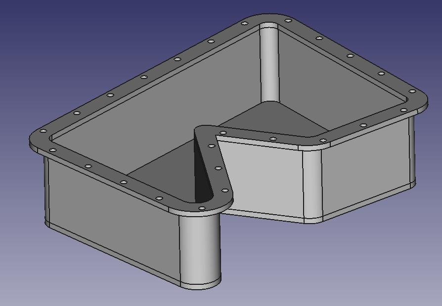
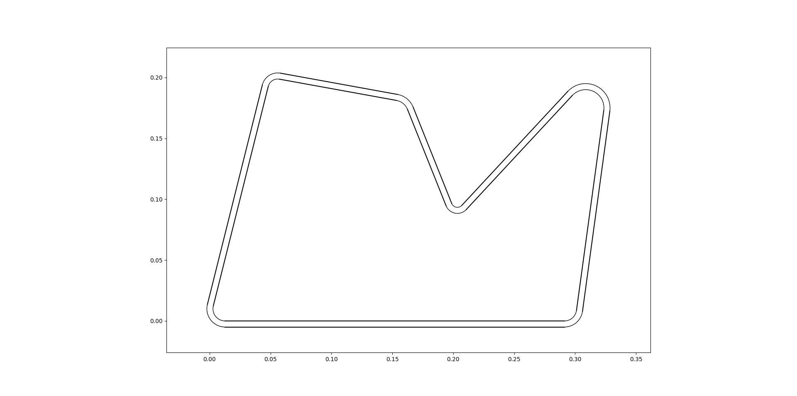
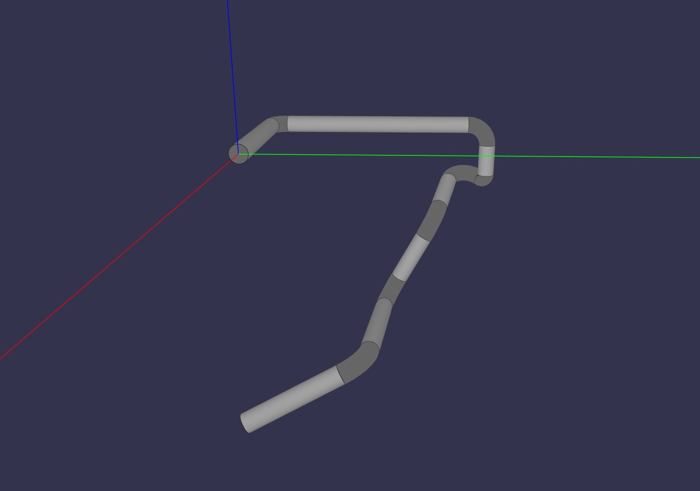
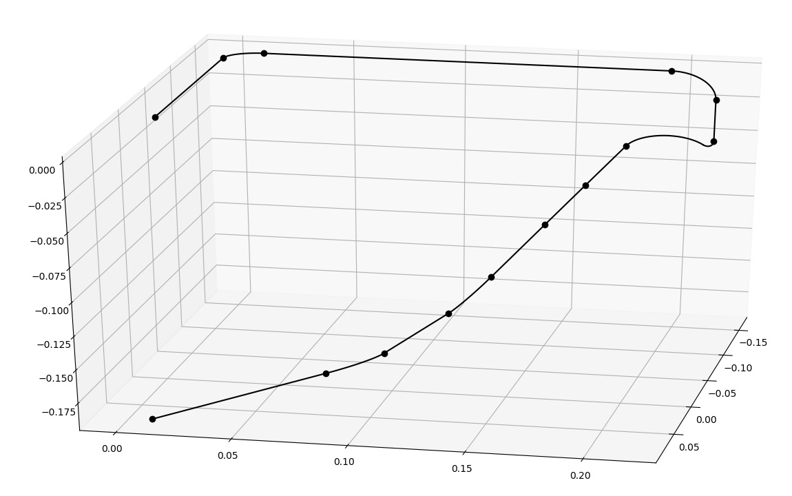
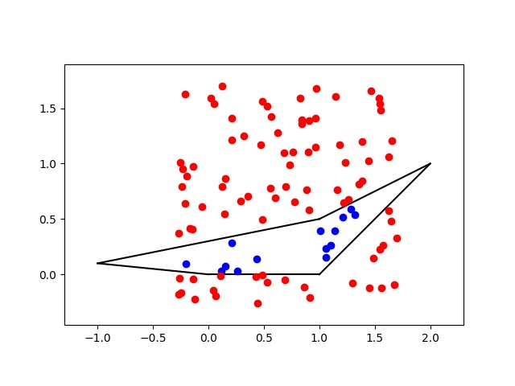

.. Volmdlr documentation master file, created by
   sphinx-quickstart on Fri Oct 12 11:25:44 2018.
   You can adapt this file completely to your liking, but it should at least
   contain the root `toctree` directive.

Volmdlr: A python volume modeler
================================

    Volmdlr is a volume modeler, which is used as a CAD plateform.
It is simple to understand and operate.
With it, you can create a lot of 3D Models easily. Check the follow examples
to see what you can do with Volmdlr.
    Volmdlr uses Babylonjs as a display.

.. toctree::
  :maxdepth: 1

  intro
  usage
  primitive2D
  primitive3D
  dev

Features
--------

 * A geometrical description of basis objects and primitives built on top: lines, points contours...
 * Computational tools for creating the geometry and to analyse it (area, second moment area, intersections, closest point, distance)
 * FreeCAD binding for exporting in .fcstd, .step, .stl
 * Volmdlr is able to read .step files (WIP)

Galery
------

Casing
~~~~~~

https://github.com/Dessia-tech/volmdlr/blob/master/scripts/casing.py

A casing is defined by a 2Dcontour formed with the primitive RoundedLineSegment2D.
This contour is offset by the casing width.

These contours are extruded to form the side shell.
A bottom is formed from an extrusion.

Screw holes are placed at equal curvilign distance of the belt.

All the primitives are fused together in a single volume.

Sweep
~~~~~

https://github.com/Dessia-tech/volmdlr/blob/master/scripts/sweep.py

A Sweep is pipes, created with Circle2D/Arc2D which is contained in a Contour2D.
You have to create the neutral fiber, i.e., the pipe's road, with the primitive RoundedLineSegment3D. 

Polygon
~~~~~~~
https://github.com/Dessia-tech/volmdlr/blob/master/scripts/polygon2D.py

A polygon is defined out of points.
Random points are sampled and the tested whether they are inside or outside of
the polygon. They are plotted with the Matplotlib binding MPLPlot with custom style:

  * red if they are outside,
  * blue if they are inside

Indices and tables
==================

* :ref:`genindex`
* :ref:`modindex`
* :ref:`search`
