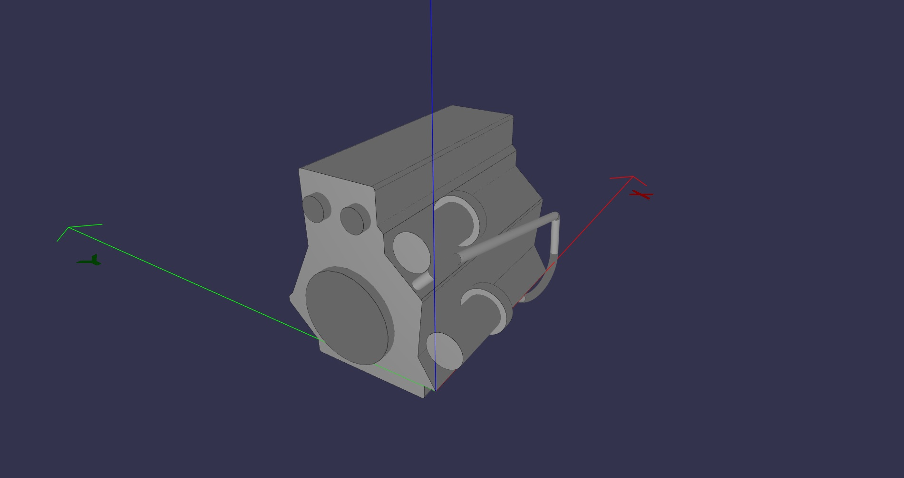

Getting started
===============

Install
-------

.. code::

  pip(3) install Volmdlr

Important
---------

Before using Volmdlr, be sure to have a compiler C/C++ (not necessary on Linux).
N.B : With Windows you have to download one and allows it to read Python's code.

CAD 
---

The following picture is here to show you about the power of Volmdlr.

https://github.com/Dessia-tech/volmdlr/blob/distancewire/scripts/Tutorial/CasTest.py

This engine is made from ExtrudedProfile and RoundedLineSegment2D. With CylindricalFace3D and ToroidalFace3D too.
You can see Sweep as presented before.
If you want to load it, run the code above, and if you are curious, check on Primitives3D how to create Faces.

